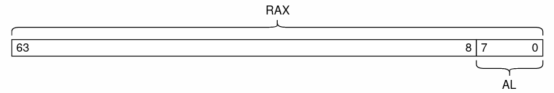

# アセンブリ入門

> 作成日時 火曜日 21 12月 2021

ネイティブなバイナリを出力するコンパイラは機械語ではなく、通常アセンブリを出力する

## 逆アセンブル入門

* `.intel_syntax noprefix`
  > アセンブリの文法を指定する命令
* `.globl plus, main`
   > plus, main への参照を外部に公開するディレクティブ

## コマンド入門

rsiの値を rsi+rdi で上書きする

```x64
add rsi, rdi   // Intel
add %rdi, %rsi // AT&T
```

rsi の値を rax に*コピー*（移動したわけじゃない）

```x64
mov rax, 8     // Intel
mov $8, %rax   // AT&T
```

* call <引数>
   1. callの次の命令（例えばret）のアドレスをスタックにプッシュ
   2. callの引数として与えられたアドレスにジャンプ
      1. Cの場合、関数名はそのまま引数になる
* ret：
   1. スタックからアドレスを1つポップ
   2. そのアドレスにジャンプ

## 記法選別

```x64
mov rbp, rsp   // Intel
mov %rsp, %rbp // AT&T

mov rax, 8     // Intel
mov $8, %rax   // AT&T

mov [rbp + rcx * 4 - 8], rax // Intel
mov %rax, -8(rbp, rcx, 4)    // AT&T
```

## レジスタ入門

1. RAX：とりあえず、関数の返り値が入っている約束になっている
2. RDI：第一引数をもらう約束になっている
3. RSI：第二引数をもらう約束になっている
4. フラグレジスタ（ステータスレジスタ）：演算や比較が実行されるたびに更新されるレジスタ。様々なフラグビットがセット可能
   1. 結果が０かどうか
   2. 結果が０未満かどうか
   3. 桁溢れが発生したかどうか

## スタック入門

1. 役割：関数処理が終了した後に、「リターンアドレス」という元々実行していたアドレスの保存
2. 手段：スタックトップを「スタックポインタ」に保持させる
   1. 通常、スタックポインタ専用のレジスタが使用される
   2. push と pop でそれぞれスタックにデータを積んだり取り出したりできる
3. call <引数>
   1. callの次の命令（例えばret）のアドレスをスタックにプッシュ
   2. callの引数として与えられたアドレスにジャンプ
4. ret：
   1. スタックからアドレスを1つポップ
   2. そのアドレスにジャンプ
5. push <値・レジスタ>
   1. スタック上に引数を乗せる
6. pop <レジスタ>
   1. スタックをポップし、戻り値を<レジスタ>に保存する

## 数学

1. add <1> <2>
2. sub <1> <2>
3. imul <1> <2>
   1. 整数の乗算のみ
4. idiv <1>
   1. EAX（RAX）/ <1>
   2. RDX と RAX を合わせて RAX の内容を128整数に拡張して、それを引数のレジスタの64ビットの値で割り、商をRAXに、余りをRDXにセットする
    > そのため、まず `cqo` を使って RAX の値を RDX に伸ばす（RDX に何が入っていたのかわからないから）
5. cqo
   1. (R)AX から (R)DX までの符号拡張：`-1 -> 111...110 -> 111...111...110`
6. cmp <1> <2>
   1. <1> と <2> を比較し、結果をフラッグレジスタにセット
7. sete/setne/setl/setle <1: 8ビットレジスタ>
   1. cmp（==/!=/</<=）の結果を引数8ビットレジスタにセット
8. movzb dest src
   1. dest の値を src で更新する
   2. src のほうが dest より短い場合、dest の最下位にセットされ、他のビットは0になる
   3. seteなどと使用し、RAX に比較の結果をセットできる 
